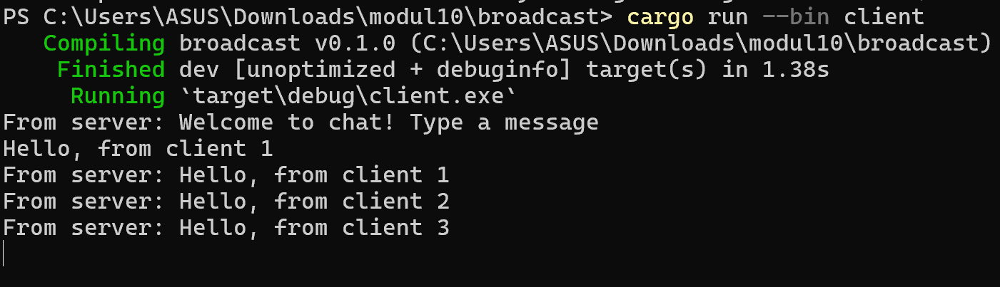
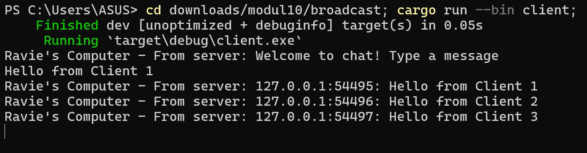
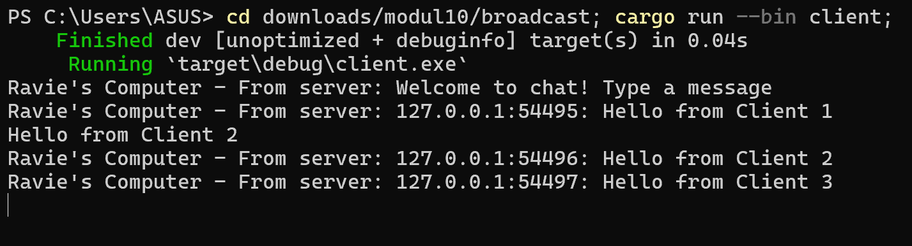
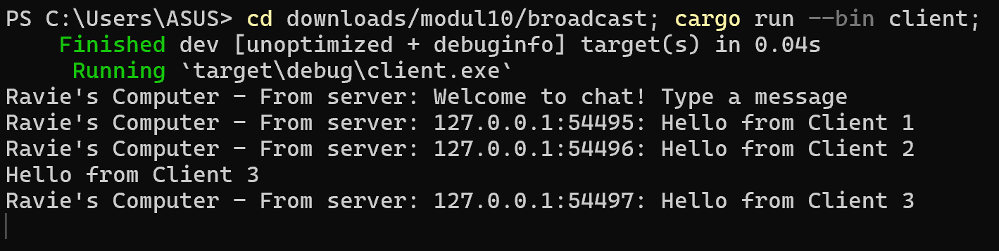
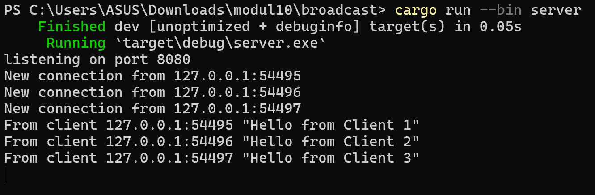

# Reflection Notes

### 2.1. Original code of broadcast chat

Server:

Client 1:

Client 2:

Client 3:

Client 1 setelah semua client mengirim pesan:

Client 2 setelah semua client mengirim pesan:

Client 3 setelah semua client mengirim pesan:

Server setelah semua client mengirim pesan:

How to run server? Jalankan command `cargo run --bin server` pada terminal. 
How to run 3 clients? Jalankan `cargo run --bin client` pada 3 terminal yang berbeda.
Ketika menjalankan server, server akan listening pada request ayng masuk di port 2000. Dengan demikian, setiap ada client yang connect, server akan print out "New connection from 127.0.0.1:(port)". Kemudian, di sisi client, akan print out "From server: Welcome to chat! Type a message" sebagai feedback bahwa sudah connected dengan server. Ketika salah satu client mengetikkan pesan, server akan print out "From client 127.0.0.1:61849 "Hello, from client 1"". Kemudian, pada sisi client, setiap client akan mendapatkan print out "From server: (message yang dikirimkan client)". Pada intinya, server akan keep track connection dengan setiap clientnnya, kemudian jika ada pesan dari suatu client, maka semua client yang connected juga akan mendapatkan pesan tersebut. Hal ini dapat dilihat pada screenshots yang telah saya cantumkan di atas.

### 2.2. Modifying the websocket port

Client 1 setelah semua client mengirim pesan:

Client 2 setelah semua client mengirim pesan:

Client 3 setelah semua client mengirim pesan:

Server setelah semua client mengirim pesan:

Dapat dilihat bahwa pada sisi server, printout yang muncul adalah "listening on port 8080", tidak lagi di port 2000 seperti sebelumnya. Kemudian, untuk interaksi yang muncul di terminal kurang lebih sama seperti sebelumnya, mengingat yang diubah hanya portnya. Perlu dicatat bahwa ketika port pada file server dan client berbeda, maka akan terjadi error. Hal ini terjadi karena server keep track connections dari client di suatu port, sedangkan client mengirimkan request ke port lain. Namun, pada kasus ini kedua file server dan client telah diset pada port yang sama. Dengan demikian, server dan client tetap dapat berinteraksi dengan lancar. Hence, interaksi yang terjadi sama seperti pada bagian 2.1 sebelumnya.

### 2.3. Small changes. Add some information to client

Client 1 setelah semua client mengirim pesan:

Client 2 setelah semua client mengirim pesan:

Client 3 setelah semua client mengirim pesan:

Server setelah semua client mengirim pesan:

Saya melakukan perubahan yang dapat dilihat pada line 23 file client.rs dan line 25 file server.rs. Perubahan tersebut bertujuan untuk menampilkan IP dan Port dari client yang mengirimkan pesan. Tujuannya adalah sebagai identifier dari setiap client mengingat setiap client tidak memiliki nama, sehingga di sini menggunakan IP dan Port. Identifier ini diperlukan karena setiap client akan mendapatkan informasi kiriman pesan client, sehingga dipeerlukan informasi dari masing-masing client. Sebagaimana dapat dilihat pada screenshot, awalnya "From server: Hello from Client 1" pada bagian 2.2. Pada bagian 2.3 ini, menjadi ada informasi IP dan Port client yang ebrsangkutan "Ravie's Computer - From server: 127.0.0.1:54496: Hello from Client 1".